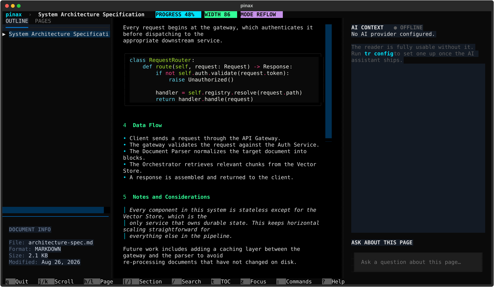
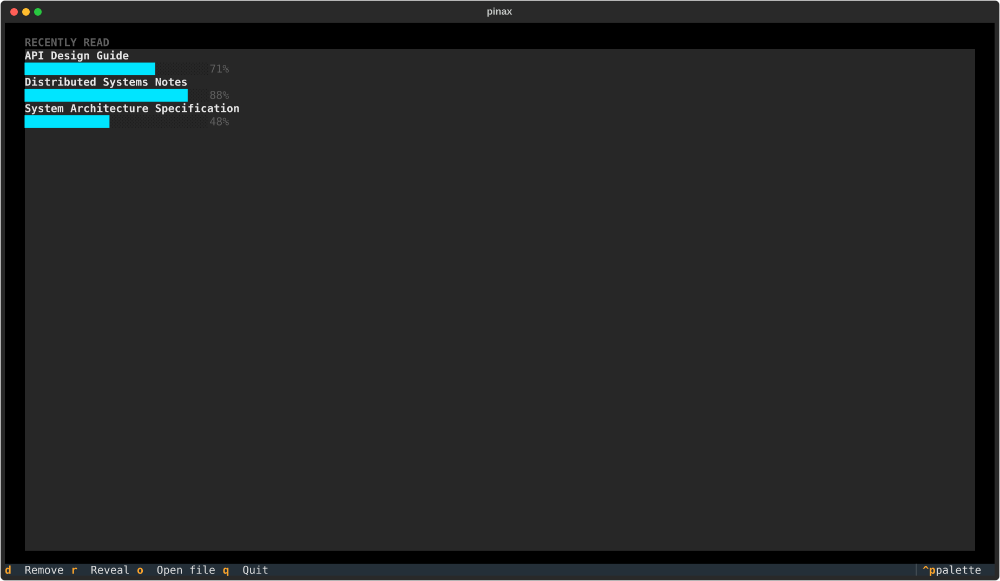

# Pinax

**A terminal-native document reader.** PDF, DOCX, EPUB, Markdown, and TXT — read, search,
and navigate them without ever leaving your terminal.

Pinax takes its name from the *Pinakes*, the catalog Callimachus compiled for the Library
of Alexandria — the first library catalog in recorded history.

```bash
pinax paper.pdf
```

opens straight into a full-screen reader: keyboard-first navigation, a table of contents,
instant full-text search, embedded images rendered via your terminal's graphics protocol
(Kitty/Sixel, with a colored half-cell fallback everywhere else), themes, and reading
progress that survives closing the terminal.

> **Status: early, actively developed.** This is Phase 1 of a longer roadmap — an excellent
> reader, no AI yet. See [Roadmap](#roadmap) below for what's next.

<p align="center">
  
</p>
<p align="center">
  
</p>

*(Screenshots above are of a synthetic demo document — see `docs/screenshots/` for how
they're generated. Real PDFs/EPUBs render the same way; images additionally render through
your terminal's graphics protocol, not shown here since these are headless captures.)*

---

## Why

Technical reading still means leaving the terminal — a browser tab, a PDF viewer, a
different keyboard model entirely. Pinax is built for people who live in `tmux`/`vim`/a
terminal multiplexer all day and want reading to feel like part of that workflow instead of
a context switch.

## Features

- **Five formats today**: PDF, DOCX, EPUB, Markdown, TXT — normalized into one internal
  document model, so every format gets the same TOC, search, and navigation.
- **Real PDF intelligence, not `pdftotext`**: reading order reconstructed from layout, not
  raw stream order; headings inferred from font size/weight or the PDF's own outline; tables
  detected and rendered as tables; code blocks detected by font (not just fenced markdown)
  and merged from PyMuPDF's per-line block splitting into one coherent panel.
- **Images that actually render**: embedded PDF images decode through your terminal's best
  available graphics protocol (Kitty Graphics Protocol → Sixel → colored half-cells), not a
  "click to view" placeholder.
- **Vim-style navigation**: `j/k` scroll, `gg`/`G`, `[`/`]` sections, `h`/`l` source pages,
  `Ctrl+d`/`Ctrl+u` half-page.
- **Instant full-text search** via SQLite FTS5, with jump-to-result.
- **Table of contents + PDF page thumbnails**, tabbed in the sidebar.
- **Reading progress that persists** — close the terminal, reopen the same file, resume
  exactly where you left off.
- **Fuzzy command palette** (`:`) and a **file picker** (`Ctrl+o`).
- **7 themes** (including a proper jet-black one), switchable live from the command palette,
  no restart needed.
- **Virtualized rendering** — a 2,000-page book costs about the same to open and scroll as a
  20-page one; only the blocks near your viewport are ever mounted.

## Install

Requires Python 3.12+. [uv](https://docs.astral.sh/uv/) is the easiest way to run it:

```bash
git clone https://github.com/rishabxx/pinax.git
cd pinax
uv sync
uv run pinax yourfile.pdf
```

Or install it as a proper command on your `PATH`:

```bash
uv tool install --editable .
pinax yourfile.pdf   # or the short alias:
tr yourfile.pdf
```

## Usage

```bash
pinax                          # open the library (recently read documents)
pinax book.pdf                 # open a document
pinax book.pdf --page 42       # open at a specific page
pinax book.pdf --search "cache invalidation"   # open and search immediately

pinax doctor                   # environment/dependency health check
pinax config                   # view (and optionally edit) the config file
pinax cache status / clear     # inspect or clear the on-disk parse cache
```

### Keybindings

| Key | Action |
|---|---|
| `j` / `k` | Scroll down / up |
| `Ctrl+d` / `Ctrl+u` | Half page down / up |
| `Space` | Page down |
| `h` / `l` | Previous / next source page |
| `[` / `]` | Previous / next section |
| `gg` / `G` | Top / bottom of document |
| `/`, `n` / `N` | Search, next / previous match |
| `t` | Toggle table of contents |
| `z` | Focus mode (distraction-free, centered) |
| `:` | Command palette (fuzzy — includes theme switching) |
| `Ctrl+o` | Open file picker |
| `Ctrl+i` | Toggle AI panel |
| `?` | Help |
| `q` / `Esc` | Close overlay / back / quit |

Full list inside the app with `?`.

## Architecture

See [`docs/ARCHITECTURE.md`](docs/ARCHITECTURE.md) for the full design: the normalized
document model, database schema, reader state machine, and the layer boundaries the
codebase enforces (parsers never know about the UI; the UI never knows how a PDF is parsed;
nothing renders directly to the terminal from inside a widget).

```
Source Document → Parser → Normalized Document → Reader Engine → Reading Context
```

## Roadmap

Built as vertical slices, one working product at each stage — not everything at once.

- [x] **Phase 1 — Reader.** Parsing, TUI, search, progress persistence, themes, images.
      *(this release)*
- [ ] **Phase 2 — AI assistant.** Context-aware Q&A about exactly what's on screen, provider-
      agnostic (OpenAI/Anthropic/Ollama/any OpenAI-compatible endpoint), fully local-capable.
- [ ] **Phase 3 — Retrieval.** Semantic search, hierarchical summaries, whole-document Q&A
      with citations.
- [ ] **Phase 4 — Power reader.** Bookmarks, notes/highlights, selection mode, reading
      history, Socratic/quiz mode.
- [ ] **Phase 5 — More formats.** HTML, PPTX, equations, OCR for scanned pages, DOCX/EPUB
      inline images.

## Contributing

Issues and PRs welcome — this is early and there's a lot of surface area. Before sending a
PR: `uv run pytest` should pass (currently 55 tests, TUI interaction tests included via
Textual's `Pilot`).

## License

[MIT](LICENSE)
